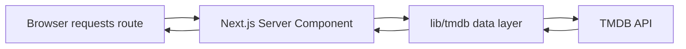
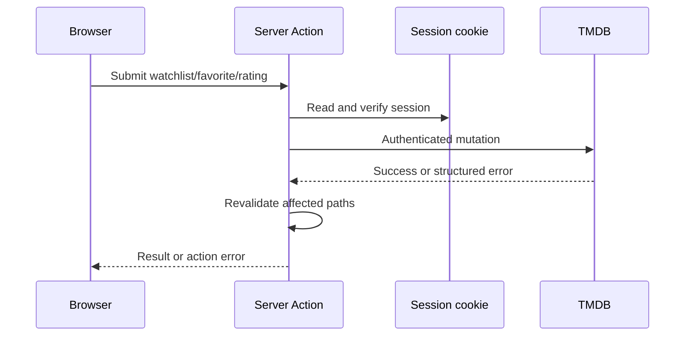
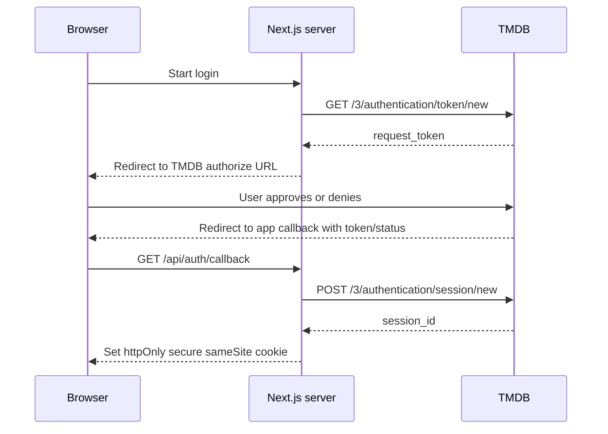

# Architecture

## Purpose

Explain where MATINÉE code runs, who initiates it, and how data and secrets cross boundaries.

## Status

Accepted runtime boundaries; caching, UI primitives, callback hardening, logout, and testing remain open.

## Related docs

[Requirements](requirements.md), [data-fetching worksheet](data-fetching-and-mutations.md), [routes](routes-and-url-state.md), [decisions](decisions.md).

## Assumptions

- Next.js 16 APIs are treated as current; `params` and `searchParams` are asynchronous.
- The browser never calls TMDB directly.
- The app has no database; TMDB is the account system and persistence layer.

## Mental model

Ask two questions for every piece of code:

1. **Where does it run?** Browser, Next.js server, or TMDB.
2. **Who initiates it?** A page request, a browser interaction, a TMDB redirect, or a server-side call.

A Server Component is the default for server-started page reads. A Client Component owns browser interaction. A Server Action is a public mutation endpoint called by a form or client interaction. A Route Handler is an HTTP endpoint for redirects or browser-readable server-mediated data.

## Stack

| Choice                      | Why                                                                                                           | Alternatives rejected for now                |
| --------------------------- | ------------------------------------------------------------------------------------------------------------- | -------------------------------------------- |
| Next.js 16 App Router       | Teaches server/client boundaries, async route APIs, streaming states, and actions in the requested framework. | Pages Router; SPA-only React.                |
| TypeScript                  | Makes TMDB shapes and boundary inputs explicit.                                                               | Plain JavaScript.                            |
| Tailwind CSS                | Matches the existing design system and keeps layout work close to markup.                                     | A new CSS framework.                         |
| TMDB API v3                 | Supplies discovery, details, authentication, and account mutations.                                           | A second media provider.                     |
| No database/auth library    | Keeps persistence and login behavior visible for learning; TMDB owns account data.                            | Prisma/database; NextAuth/Auth.js at launch. |
| No TanStack Query initially | Avoids hiding Next.js caching and server rendering concepts.                                                  | Add later after the baseline is understood.  |

## Page read flow

## Mutation flow

## Auth sequence

## Folder structure

| Path                          | Purpose                                                                               | Why separated                                           |
| ----------------------------- | ------------------------------------------------------------------------------------- | ------------------------------------------------------- |
| `app/`                        | Routes, layouts, loading/error/not-found boundaries, and the two Route Handler paths. | Keeps routing and rendering concerns visible.           |
| `app/api/auth/callback/`      | GET callback from TMDB; validates callback and sets cookie.                           | Only an HTTP redirect endpoint should own this flow.    |
| `app/api/search/suggestions/` | Browser-facing suggestions endpoint that calls the server data layer.                 | Keeps the token off the client.                         |
| `actions/`                    | `auth.ts` and `account.ts` Server Actions.                                            | One explicit home for mutations.                        |
| `components/layout/`          | Navbar, menus, shell.                                                                 | Shared navigation is separate from media rendering.     |
| `components/media/`           | Poster cards, details, cast, seasons, companies.                                      | Media presentation can be reused across movies and TV.  |
| `components/filters/`         | URL-writing filter controls and pagination.                                           | Client interaction stays narrow.                        |
| `components/ui/`              | Buttons, inputs, menus, status and feedback primitives.                               | Shared states follow the design system.                 |
| `lib/tmdb/`                   | Server-only client, feature modules, types, response mapping.                         | One boundary owns authorization and endpoint knowledge. |
| `lib/auth/session.ts`         | Cookie read/validation and session helpers.                                           | Centralizes session mechanics without an auth library.  |
| `lib/constants.ts`            | Categories, limits, cookie names, and stable values.                                  | Prevents route and UI drift.                            |

## Security architecture

- Store the TMDB Read Access Token only in a server-only variable; never name it `NEXT_PUBLIC_*`.
- Use an httpOnly cookie so JavaScript cannot read the session ID; use `secure` to require HTTPS in production; use `sameSite` to reduce cross-site request sending. Exact policy is an open decision where environment behavior matters.
- Import `server-only` from the data layer so accidental client imports fail early.
- Treat every Server Action as a public endpoint: verify the session, validate IDs/types/rating bounds, and ignore authority claims from the browser.
- Callback redirects must allowlist the app’s own destinations; never reflect arbitrary `next` values.
- Do not log bearer tokens, request tokens, session IDs, cookies, or raw authorization headers.

## Environment variables

| Name                     | Server-only? | Purpose                                                   |
| ------------------------ | ------------ | --------------------------------------------------------- |
| `TMDB_READ_ACCESS_TOKEN` | Yes          | TMDB API Bearer credential.                               |
| `TMDB_API_BASE_URL`      | Yes          | API base URL; default may be documented in configuration. |
| `TMDB_IMAGE_BASE_URL`    | Yes          | Optional configured image base URL.                       |
| `APP_URL`                | Yes          | Validated callback and redirect origin.                   |
| `SESSION_COOKIE_NAME`    | Yes          | Cookie name; may be a constant instead.                   |

## Error handling

| Layer               | Responsibility                                                                                                        |
| ------------------- | --------------------------------------------------------------------------------------------------------------------- |
| Data layer          | Normalize HTTP/API failures into safe typed errors; preserve status for server decisions; never expose credentials.   |
| Route/page boundary | Use `loading.tsx` for pending reads, `error.tsx` for recoverable route failures, and `not-found.tsx` for missing IDs. |
| UI                  | Render empty-state copy for valid zero results and image/data fallbacks for missing fields.                           |
| Mutation feedback   | Return safe action results; show pending state and a toast or inline error; revalidate after success.                 |
